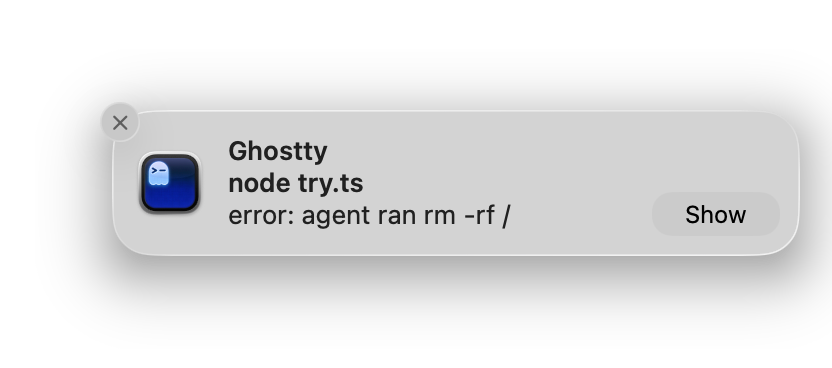

<div align="right">



</div>

# opencode-osc9

A zero-dependency [opencode](https://opencode.ai) plugin that sends desktop notifications via [**OSC 9**](https://ghostty.org/docs/vt/osc/9) escape sequences when tasks complete.

Works with any terminal that supports OSC 9, including **Ghostty**, **iTerm2**, **kitty**, **WezTerm**, and others.

## Install

Add `"opencode-osc9"` to the `plugins` array in your opencode config (usually `~/.config/opencode/opencode.jsonc`):

```jsonc
{
  "plugin": ["opencode-osc9@latest"]
}
```

## Try it

You can test OSC 9 support in your terminal by running the included `try.ts`:

> [!TIP]
> Most terminals won't fire a notification if the window is focused so a 3 second delay is baked into the `try.ts` script to give you time to change app focus.

```sh
# bun
bun try.ts

# node (v24+)
node try.ts
```
